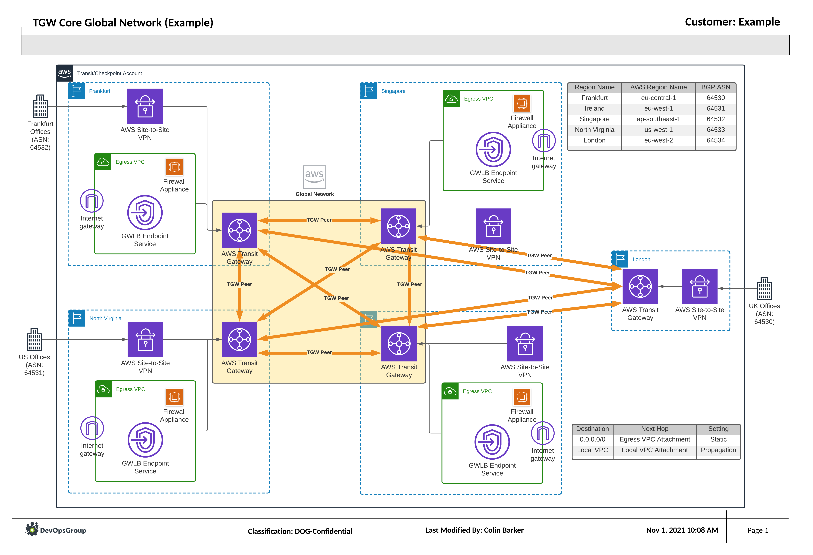
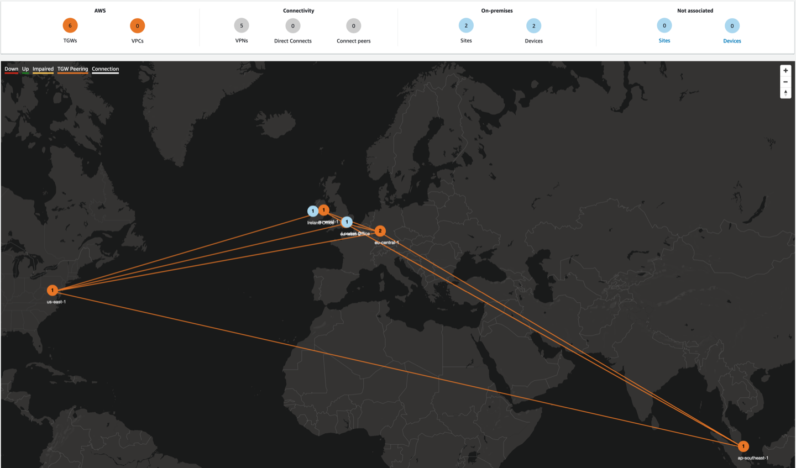

# Transit Gateway Core Network

## Summary

The AWS Transit Gateway service is a very versatile, cross-regional, router that
can be peered together to create a direct link between services in different
locations. This core network is the heart of the design, allowing for external
services including Site-to-Site VPN's and AWS Direct Connect to be directly
attached to the core, without the use of VPCs. In this snippet we will be
creating the core, with a small number of routing tables to ensure traffic is
routed to the correct location.

## Design

## Example from AWS Global Network

