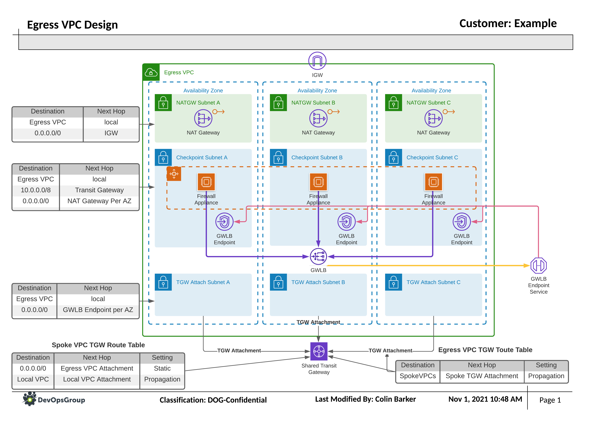

# Egress VPC

## Summary

This snippet creates the shell VPC and it's required attachments for the Egress VPC.
For this example we are not creating the Firewall Appliance AutoScaling group.
The primary element is the use of the Gateway Load Balancers and the VPC
Endpoint Services. This creates the endpoint which the routing tables in other
VPC's can use to encapsulate traffic using the GENEVE protocol to the 3rd party
firewall appliances. The additional VPC Endpoint Services are used for Egress
Traffic, which override the routing to the NAT Gateway, and filter the traffic
before the appliance uses the NAT Gateway to get to the internet.

### AWS Services Used

- [VPC](https://aws.amazon.com/vpc/)
- [NAT Gateways (NATGW)](https://docs.aws.amazon.com/vpc/latest/userguide/vpc-nat-gateway.html)
- [Gateway Load Balancers (GWLB)](https://aws.amazon.com/elasticloadbalancing/gateway-load-balancer/)
- [VPC Endpoint Services](https://docs.aws.amazon.com/vpc/latest/privatelink/endpoint-service.html)
- [VPC Endpoints](https://docs.aws.amazon.com/vpc/latest/privatelink/vpc-endpoints.html)
- [Transit Gateway Attachments (TGW-a)](https://docs.aws.amazon.com/vpc/latest/tgw/tgw-vpc-attachments.html)

## Specific changes for snippet

While this is the 2nd part of this snippet, it does not link to the 1st part in
this example. Typically this snippet would be deployed in each region using the
same Terraform. You would then chose the Transit Gateway to link to based on the
region that it was deployed in. To make this snippet simpler to demonstrate, a
specific Transit Gateway (TGW) has been setup to connect this Egress VPC to, rather
than one of the TGWs from the `1-transit-gateway-core-network` snippet.

This snippet will output a VPC Endpoint service ARN and a Transit Gateway ID.
This ARN and ID will be required if you wish to deploy the `3-dmz-vpc` snippet.
This is added in the snippet's `variables.tf` file so that the 3rd part can link
to the VPC Endpoints and TGW created in this example.

## Design

