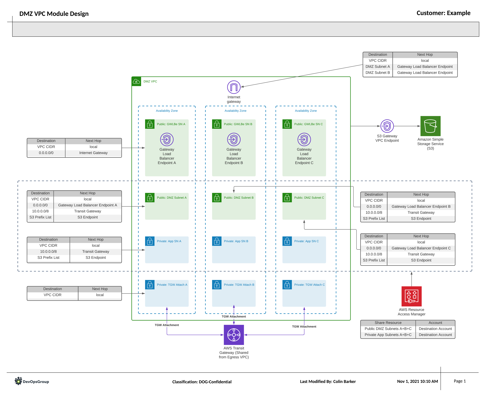

# DMZ VPC

## Summary

This snippet creates the DMZ VPC, used to host the externally available services
within the core network. Any service, for example an Application Load Balancer
which sits in side the Public DMZ Subnet, will have its traffic routed by the
Internet Gateway to the Gateway Load Balancer Endpoints within each Availability
Zone. This is forwarded over to the 3rd Party Firewall Appliances, to do traffic
filtering, before being passed back through to the external service in the Public
DMZ Subnets. After that, all traffic proceeds as normal.

Outbound traffic is then captured by the route tables applied to the Private
Application Subnets, and pushed through the Transit Gateway, this then routes
to the Egress VPC where outbound traffic filtering can take place.

### AWS Services Used

- [VPC](https://aws.amazon.com/vpc/)
- [VPC Endpoint Services](https://docs.aws.amazon.com/vpc/latest/privatelink/endpoint-service.html)
- [Transit Gateway Attachments (TGW-a)](https://docs.aws.amazon.com/vpc/latest/tgw/tgw-vpc-attachments.html)

## Requirements

For this to work, you will need to ensure that the `2-egress-vpc` part of this
snippet has been deployed. Part of the outputs of this section will be the VPC
endpoint ID, which will need to be updated in the `variables.tf` file within
this area.

## Design

