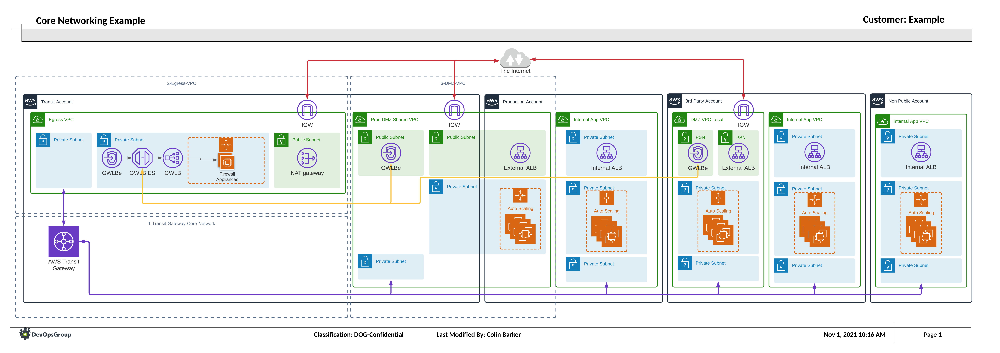

# Transit Gateways with Firewall Appliances using Gateway Load Balancers

⚠️ While these Terraform Files will deploy a running service, as a snippet it is
not guaranteed that these will deploy all the time. Please use these as an
example of how this can be created. ⚠️

## Summary

This snippet is a bunch of Terraform used to confirm that the design for a
multi-account, AWS Transit Gateway (TGW) solution could be used using a 3rd party
Firewall Appliance running on EC2, that is compatible with the GENEVE protocol
using AWS Gateway Load Balancers. This snippet allows for the control of inbound
and outbound traffic to external services to be forwarded and processed by the
3rd party firewall appliance.

This snippet is based off the [reference architecture documentation](https://aws.amazon.com/blogs/networking-and-content-delivery/introducing-aws-gateway-load-balancer-supported-architecture-patterns/) supplied by AWS.

This creates both an East<->West and North<->South firewall system that can be a
requirement for a number of FSI's.

## Transit Gateway Core Network

This is the core of the snippet example, this sets up a set of TGWs in different
regions, using a different BGP ASN for each gateway, and the peering between.
In the example, within AWS, it is setup as a mesh of peers so that any one peer
going offline will not affect the core network. From here, all of the additional
connections will connect in a "hub-and-spoke" method.

[Transit Gateway Core Network Snippit](./1-transit-gateway-core-network)

## Egress VPC

The key part for inbound and outbound traffic, using a Gateway Load Balancer (GWLB),
VPC Endpoint Services, and specifically placed and created route tables, we are
able to intercept the inbound and outbound traffic, and process them through the
firewall appliances. The deployment will sit specifically inside a Transit
Account so that any networking teams will have full control over the flow of
traffic throughout the organisation.

[Egress VPC Snippet](./2-egress-vpc)

## DMZ VPC

The final part of the deployment is being able to intercept the traffic coming
inbound from the outside world. This is done using a specifically crafted VPC,
that places a Route Table on the Internet Gateway attached to the VPC, that
redirects traffic from the external service through to the GWLB Endpoint Service.
The traffic is then forwarded through to the Egress VPC, where the appliances
then scan the traffic, and the appliances then forward it back using the GENEVE
protocol back to the external service, where normal routing will continue.

[DMZ VPC Snippet](./3-dmz-vpc)
